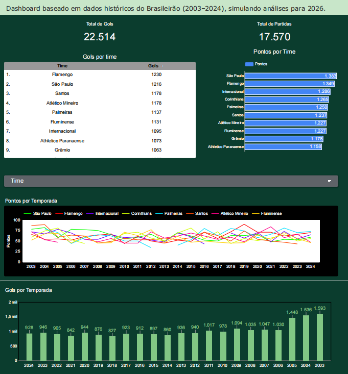

# Dashboard Brasileirão 2003–2024

Projeto de análise de dados do Campeonato Brasileiro utilizando dados históricos de 2003 até 2024, simulando análises para 2026.

## 📊 Informações analisadas

- Total de gols
- Pontos por equipe
- Evolução por temporada
- Desempenho ofensivo

## 🛠 Tecnologias utilizadas

- Google Looker Studio

## 📁 Arquivos

- Dashboard em PDF

## 📌 Objetivo

Praticar análise de dados, visualização e construção de dashboards esportivos.

## 📷 Preview

